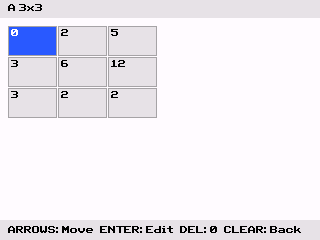
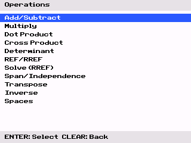

<h1 align="center">Step by Step Linear Algebra for the TI84+ CE</h1>

  
  &nbsp;&nbsp;
  

A linear algebra program for the TI-84 Plus CE graphing calculator. **Matrix** automates the mechanical parts of linear algebra, such as computing determinants, row reductions, inverses, Cramer's rule, and more, while **showing every step** so you can follow along

Steps are rendered as typeset LaTeX directly, powered by the bundled [libtexce](https://github.com/Sightem/libtexce) rendering engine

---

- [Features](#features)
- [Getting Started](#getting-started)
- [How to Use](#how-to-use)
- [Contributing](CONTRIBUTING.md)

---

Linear algebra courses require you to work through lengthy and repetitive calculations by hand. **Matrix** does the calculations for you and shows you its steps:

- Enter integer matrices up to **6x6** using a familiar spreadsheet style editor
- Pick an operation from a menu and get the result instantly
- Tap a key to page through **step by step LaTeX explanations** of the entire computation
- **Exact rational arithmetic** results are displayed as fractions
- Runs natively on your TI-84+ CE

## Features

### Matrix Operations

| Operation | Description |
|---|---|
| **Add / Subtract** | Element-wise matrix addition and subtraction |
| **Multiply** | Full matrix multiplication with dot-product steps |
| **Transpose** | Transpose of any matrix |
| **Determinant** | Cofactor expansion with smart row/column selection |
| **Inverse** | Gauss-Jordan elimination on the augmented matrix [A \| I] |
| **REF / RREF** | Row Echelon Form and Reduced Row Echelon Form |
| **Cramer's Rule** | Solve Ax = b with per-Δ step breakdowns |
| **Minor / Cofactor** | Compute M\_{ij} and C\_{ij} for any element |
| **Minor Matrix** | Full matrix of minors |

### Vector Operations

| Operation | Description |
|---|---|
| **Dot Product** | Scalar dot product of two vectors |
| **Cross Product** | 3D cross product |
| **Projection** | Orthogonal projection of **u** onto **v** plus the orthogonal complement |

### Subspace Analysis

| Operation | Description |
|---|---|
| **Column Space Basis** | Basis for Col(A) via pivot columns |
| **Row Space Basis** | Basis for Row(A) via non zero rows of RREF |
| **Null Space Basis** | Basis for Null(A) from free variables |
| **Left Null Space Basis** | Basis for Null(Aᵀ) |
| **Span Test** | Test whether a vector is in the span of a set or R^m |
| **Independence Test** | Test whether a set of vectors is linearly independent |
| **Solve via RREF** | Solve a linear system using row reduction |

### Step by Step Explanations

Every operation generates a detailed explanation:

- Navigate forward and backward through steps with the **left/right arrow keys**
- Each step shows a plain text caption (e.g., `R_2 ← R_2 − 2R_2`) and a **LaTeX rendered matrix or expression**
- For multi part operations like Cramers rule, a sub menu lets you inspect each individual Δ\_i determinant

## Getting Started

### Requirements

- A **TI-84 Plus CE** or **TI-84 Plus CE Python Edition**
- A USB cable and software to transfer files to the calculator [Ti connect CE](https://education.ti.com/en/products/computer-software/ti-connect-ce-sw) for windows and [webtilp](https://tiplanet.org/scripts/webtilibs/webtilp.html) for MacOS/Linux/Chromebooks

### Installation

1. Download the latest **MATRIX.8xp** from the [Releases](https://github.com/Sightem/matrix/releases) page
2. Connect your calculator to your computer via USB
3. Get clibs from https://tiny.cc/clibs
4. If you are on an OS above version 5.4, you need [arTIfiCE](https://yvantt.github.io/arTIfiCE/) to launch the program (this is likely the case)
3. Open TI Connect CE or webtilp and send `MATRIX.8xp` to your calculator, the fonts, and clibs and arTIfiCE (make sure to choose ARCHIVE when prompted)

### Quick Start

1. From the main menu, select **Matrices** -> **Edit A**
2. Set the dimensions (e.g., 3x3) using the arrow keys then press **[enter]**
3. Navigate to each cell with the arrow keys, press **[enter]** to type a value and confirm with **[enter]**
4. Press **[clear]** to finish editing, then go to **Operations** -> **Determinant**
5. Select slot **A**. the determinant is computed and displayed
6. Press a key to view the **step by step** cofactor expansion, rendered in LaTeX
7. Use **left/right arrows** to page through steps; **[clear]** to go back

---

## How to Use

### Navigation

| Key | Action |
|---|---|
| **UP / DOWN** | Scroll through menus and matrix rows |
| **LEFT / RIGHT** | Navigate matrix columns; page through steps |
| **[enter]** | Select a menu item, confirm input, or edit a cell |
| **[clear]** | Go back one screen |
| **[del]** | Set the current cell to 0 (in the editor) |
| **[2nd]** | Finish editing a matrix |

### Editing Matrices

- Dimensions are set with an arrow key selector (1-6 for both rows and columns)
- The grid editor shows all cells at once
- Cell values are entered in a footer input line (supports multi digit numbers and negative signs)
- Resizing a matrix clears its contents

### Step Viewer

- Steps are rendered one at a time using LaTeX. each page shows a caption and a typeset formula or matrix
- The step counter (e.g., `3/7`) tells you where you are
- For complex operations (Cramer's rule), a sub menu lets you view each sub computation

## Contributing

See [CONTRIBUTING.md](CONTRIBUTING.md) for the technical overview, project structure, build instructions, and testing.